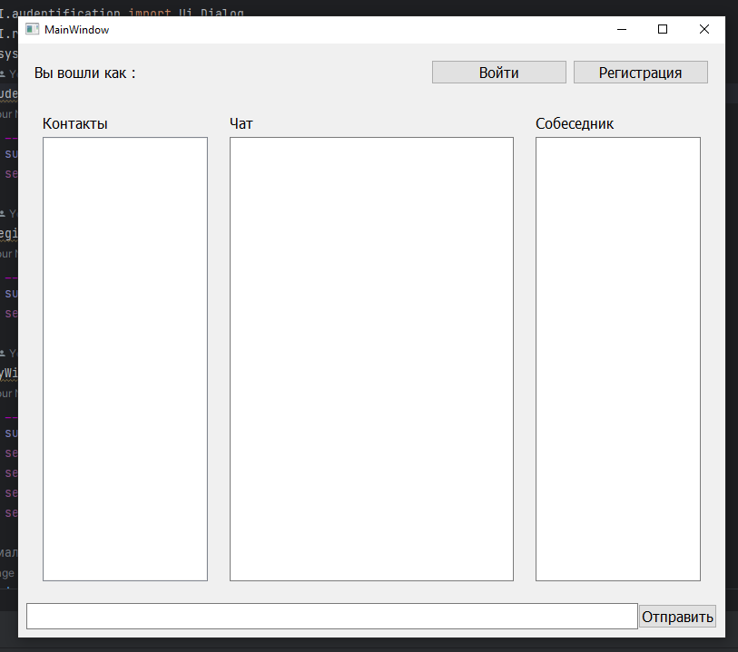

### Разработать приложение мессенджера (на выбор desktop/web/mobile). Требуется написать use case диаграмму, выбрать архитектуру для приложения (кратко обосновать выбор), UML и ER диаграммы для выбранной архитектуры. Используя метод персон (не менее 3), описать каких функций не хватает. Пересмотреть UML и ER диаграммы с учетом недостатков. Создать интерфейс в figma для приложения.

#### use case диаграмму

Выбрана клиент-серверная архитектура для приложения мессенджера. Приложение будет иметь клиентскую часть, реализованную на desktop, которая будет общаться с сервером, ответственным за хранение и передачу сообщений и данных пользователей. Такая архитектура позволит обеспечить высокую надежность и масштабируемость системы, а также обеспечит защиту данных пользователей.

#### UML_Diagramm

#### ER_Diagramm

#### Интерфейс

#### Тестирование регистрации и аторизации пользователей

Интеграционное тестирование:

Для проверки работы всего стека функций регистрации и авторизации следует провести интеграционное тестирование.
Использование тестовых окружений и баз данных.
Проведение сценариев взаимодействия с приложением, включающих регистрацию и авторизацию пользователя, а также проверку логики бизнес-процессов.

Тестирование безопасности:

Важным аспектом тестирования стека регистрации и авторизации является проверка безопасности.
Необходимо проверить систему на уязвимости, такие как подбор паролей, секретные вопросы безопасности, уязвимости в аутентификации и авторизации.
Использование инструментов для анализа кода и поиска уязвимостей могут помочь выявить потенциальные проблемы.

Тестирование производительности:

В случае необходимости выполнять тестирование производительности, можно использовать инструменты для нагрузочного тестирования, например, Locust или JMeter.
Тестирование производительности должно определить максимальные нагрузки, при которых стек регистрации и авторизации будет продолжать работать стабильно и отвечать на запросы пользователей в заданные временные рамки.